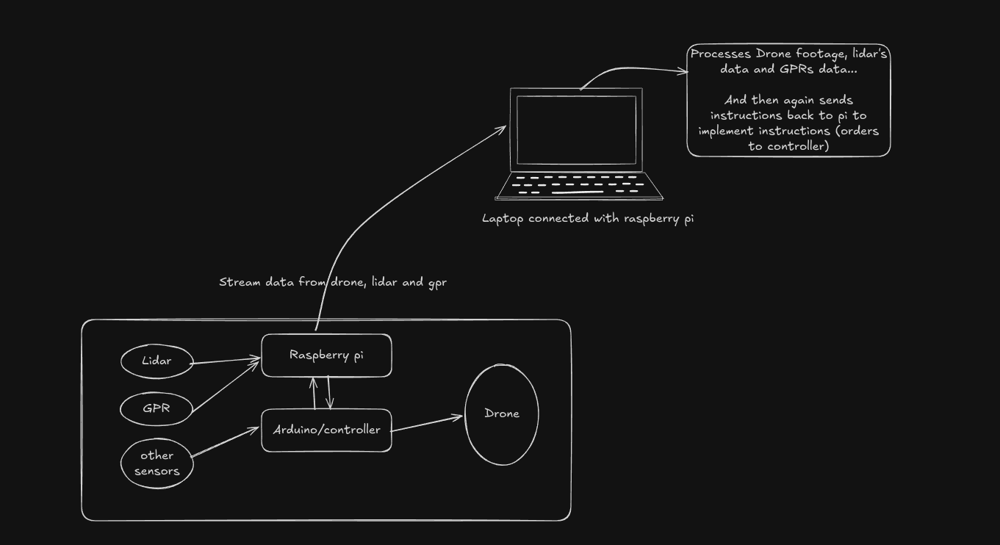

# Drone-Based Landslide Search and Rescue System

## **Project Overview**
This project aims to develop a drone-based system equipped with LiDAR, Ground Penetrating Radar (GPR), and other sensors to assist in locating individuals trapped in landslides. The system processes data from the sensors, performs real-time analysis, and provides actionable insights for rescue operations.

The system is modular, comprising a drone, onboard Raspberry Pi, an Arduino controller, and a laptop for advanced data processing.

---

## Architecture

## **Features**
- **Real-time Sensor Data Streaming**: Streams data from LiDAR, GPR, and other sensors to a laptop.
- **Data Processing and Analysis**: Processes sensor data for detecting trapped individuals.
- **Autonomous Navigation**: Controls drone movement and obstacle avoidance using processed data.
- **Modular Design**: Ensures scalability for adding new sensors or components.

---

## **Architecture**
1. **Onboard Components**:
   - **Raspberry Pi**: Central hub for data collection and communication.
   - **Arduino/Controller**: Manages drone movements and interacts with low-level sensors.
   - **Sensors**: LiDAR, GPR, and others for environmental data collection.
2. **Laptop**:
   - Processes sensor data and sends instructions back to the drone for autonomous operation.

---

## **What You Need to Learn**
To successfully build this project, you'll need knowledge in the following areas:

### **1. Hardware and Electronics**
- **Raspberry Pi**:
  - Setup, GPIO usage, and interfacing sensors.
  - Communication protocols: I2C, SPI, UART.
- **Arduino**:
  - Programming with Arduino IDE.
  - Interfacing with motors, sensors, and Raspberry Pi.
- **Sensors**:
  - LiDAR basics and data integration.
  - Ground Penetrating Radar (GPR): Signal processing techniques.
  - Accelerometers and gyroscopes for drone stability.
- **Drone Mechanics**:
  - Motors, ESCs, and flight controller calibration.

### **2. Software Development**
- **Embedded Programming**:
  - Python for Raspberry Pi.
  - C++ for Arduino.
- **Data Streaming and Communication**:
  - Protocols: MQTT, WebSocket, HTTP.
- **Drone Control**:
  - MAVLink and DroneKit.
  - Flight control algorithms.

### **3. Computer Vision and Signal Processing**
- **Computer Vision**:
  - OpenCV for image processing and object detection.
- **Signal Processing**:
  - Data filtering and interpretation for LiDAR and GPR.

### **4. Machine Learning (Optional)**
- **For Sensor Data Analysis**:
  - ML algorithms for pattern recognition.
  - Libraries: TensorFlow, PyTorch.
- **For Vision Tasks**:
  - Pretrained models for object detection (YOLO, SSD).

### **5. Networking and Communication**
- **Networking Basics**:
  - IP configuration, routers, and switches.
- **Remote Access**:
  - SSH, VNC for accessing Raspberry Pi.

### **6. Power Management**
- **Power Distribution**:
  - Calculate power requirements for all components.
  - Voltage regulation for stable operation.

### **7. Robotics Frameworks**
- **ROS (Robot Operating System)**:
  - Sensor integration, visualization (RViz), and navigation.
- **Autonomous Navigation**:
  - SLAM (Simultaneous Localization and Mapping).

### **8. GPU Programming (Optional)**
- **CUDA**:
  - For accelerating computation on NVIDIA GPUs (e.g., Jetson Nano).

---

## **Tools and Resources**
### **Hardware Requirements**:
- Raspberry Pi (preferably Pi 4 or Pi 5).
- Arduino (e.g., Arduino Uno).
- Drone with modular capabilities.
- Sensors: LiDAR, GPR, accelerometers, and gyroscopes.

### **Software and Libraries**:
- Python (with libraries: OpenCV, TensorFlow, PyTorch).
- C++ for Arduino and sensor programming.
- ROS for robotics integration.
- CUDA for GPU-based computation (if required).

### **Books and Courses**:
- "Learning Robotics Using Python" for ROS basics.
- "Python Programming for Raspberry Pi".
- Online tutorials for LiDAR and GPR integration.

### **Simulation Tools**:
- AirSim or Gazebo for testing drone navigation and sensor performance.

---

## **Milestones**
1. **Hardware Integration**: Connect Raspberry Pi, Arduino, and sensors.
2. **Data Streaming**: Stream sensor data to a laptop in real-time.
3. **Data Processing**: Implement algorithms for analyzing LiDAR and GPR data.
4. **Drone Control**: Enable semi-autonomous and autonomous navigation.
5. **Field Testing**: Test the system in real-world scenarios.

---

## **Future Enhancements**
- Integration of thermal cameras for better detection in harsh environments.
- Adding more advanced ML models for terrain and victim identification.
- Expanding modularity for additional sensors and features.

---